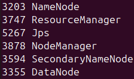
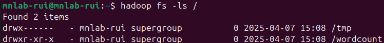
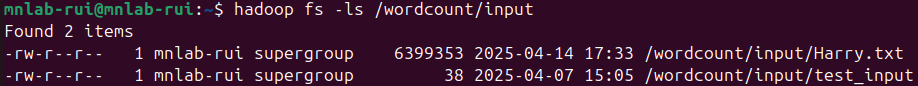
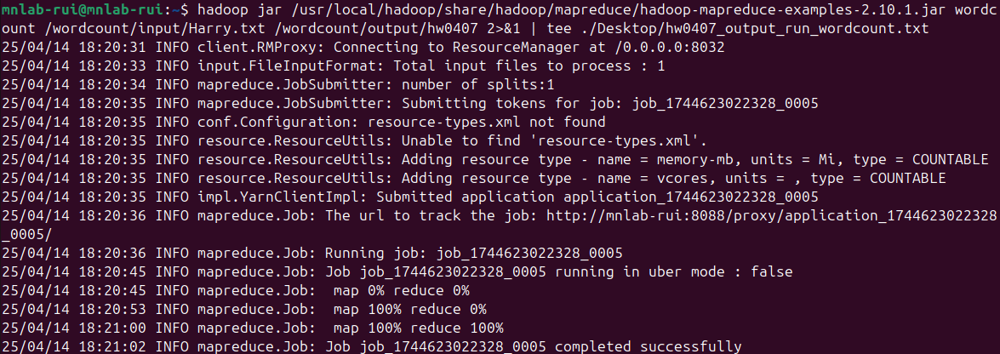
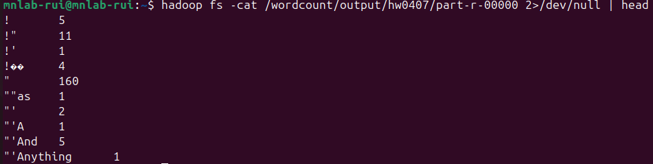

# HW250407-word_counting

## Assignment Requirements
It is an example for word counting. (word with appearance times)  
Please  "screenshot" Hadoop/MapReduce WordCount result and upload it to ULearn.  
這是一個作業範例檔案  
請計算本檔案所出現的文字與其次數  
請用螢幕截圖、上傳到Ulearn系統繳交作業
> You can download the file [here](https://github.com/LouisScorpio/datamining/raw/refs/heads/master/tensorflow-program/nlp/word2vec/dataset/%E5%93%88%E5%88%A9%E6%B3%A2%E7%89%B91-7%E8%8B%B1%E6%96%87%E5%8E%9F%E7%89%88.txt)

## 過程
### 由於先前已有執行過，所以從這步開始
``` bash
start-all.sh
```
### 利用 `jps` 檢查是否正確
``` bash
jps
```
#### 輸出:

``` text
* NameNode
* ResourceManager
* Jps
* NodeManager
* SecondaryNameNode
* DataNode
```
> \* 為 \<hostid\>，如: 3952。

### 在 HDFS 建立資料夾
建立資料夾
``` bash
hadoop fs -mkdir -p /wordcount/input
```
查看資料夾
``` bash
hadoop fs -ls /
```


### 將檔案放入 HDFS 中
``` bash
hadoop fs -copyFromLocal ./Desktop/Harry.txt /wordcount/input
```
確認是否有放入:
``` bash
hadoop fs -ls /wordcount/input
```


#### 例外訊息: 
*copyFromLocal: Cannot create file/wordcount/input/Harry.txt._COPYING_. Name node is in safe mode.*  
目前解決方法:
``` bash
hdfs dfsadmin -safemode leave
```

### 執行
``` bash
hadoop jar /usr/local/hadoop/share/hadoop/mapreduce/hadoop-mapreduce-examples-2.10.1.jar wordcount /wordcount/input/Harry.txt /wordcount/output/hw0407
```
#### 輸出

[完整內容](output/run_jar.txt)

### 察看結果
確認是否有輸出:
``` bash
hadoop fs -ls /wordcount/output/hw0407
```
查看結果: (根據內容長度，終端機可能會截斷)
``` bash
hadoop fs -cat /wordcount/output/hw0407/part-r-00000
```
只取 head:
``` bash
hadoop fs -cat /wordcount/output/hw0407/part-r-00000 2>/dev/null | head
```

儲存結果:
``` bash
hadoop fs -cat /wordcount/output/hw0407/part-r-00000 > ./Desktop/hw0407_output.txt
```
[完整內容](output/output.txt)